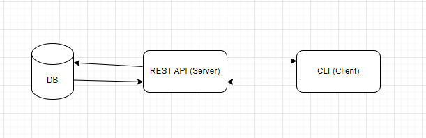
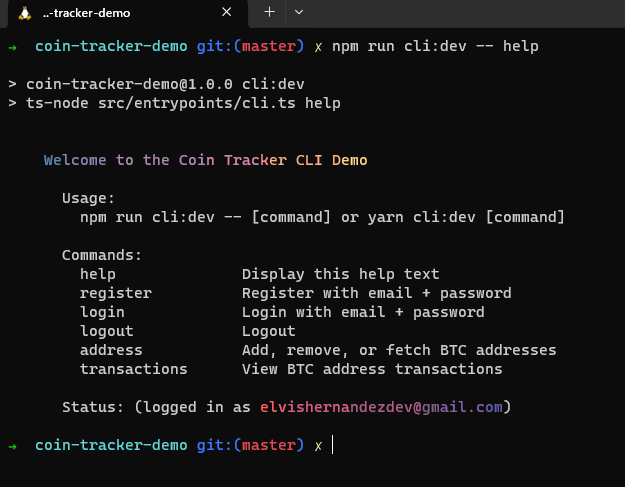
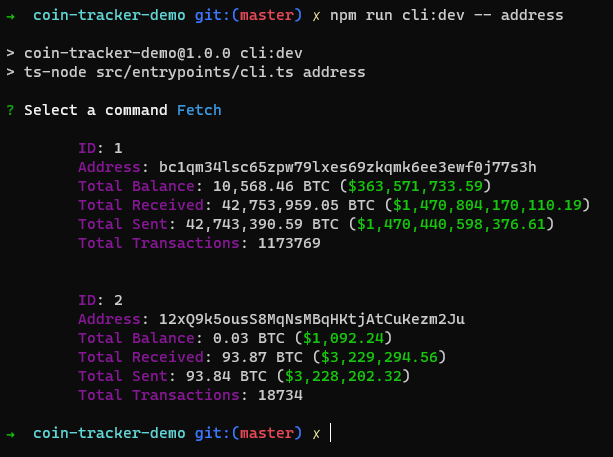
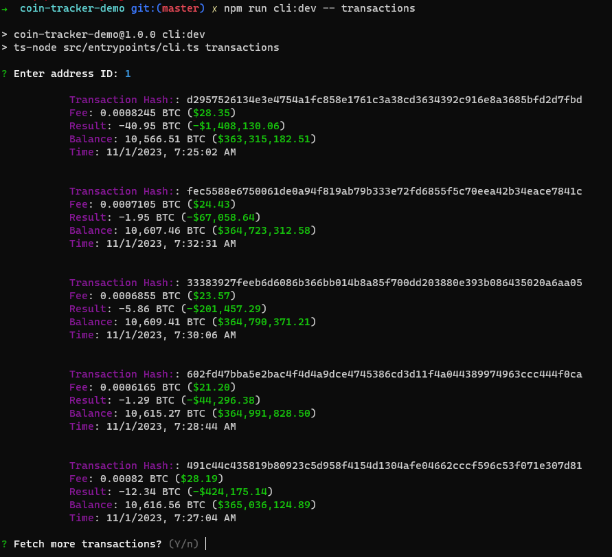

# Coin Tracker Demo

## Setup local environment

### Dependencies

- Docker + Docker Compose (Docker Compose: 1.25.5 or later)
- Node v18

### Steps

```bash
cd /project-root
npm install
docker compose up -d
npm run prisma:migrate
```

Now you can interact with the API directly either with something like cURL or Postman, or with the built-in CLI.

## Overview

This repo hosts the code for an application which follows a standard client-server architecture. The client in this case is a minimal Command Line Interface (CLI) whose purpose is to query the REST API, aka the server.



## Technologies Used

- Typescript (NodeJS)
- PostgreSQL (Database)
- Prisma (ORM)
- Docker (For local development)

## CLI

Available commands. Address command actually has 3 nested commands

- Add
- Remove
- Fetch



BTC Addresses


BTC Address Transactions


## REST API DOCS

REST API meant to allow users to add, remove, and query info on their BTC Addresses

# 📁 Collection: Auth

## End-point: Register User

Registers a user with email + password. Returns JWT token for use in authenticated requests.

### Method: POST

> ```
> /api/v0.1/register
> ```

### Body (**raw**)

```json
{
  "name": "Elvis Hernandez",
  "email": "elvishernandezdev@gmail.com",
  "password": "123456"
}
```

⁃ ⁃ ⁃ ⁃ ⁃ ⁃ ⁃ ⁃ ⁃ ⁃ ⁃ ⁃ ⁃ ⁃ ⁃ ⁃ ⁃ ⁃ ⁃ ⁃ ⁃ ⁃ ⁃ ⁃ ⁃ ⁃ ⁃ ⁃ ⁃ ⁃ ⁃ ⁃ ⁃ ⁃ ⁃ ⁃ ⁃ ⁃ ⁃ ⁃ ⁃ ⁃ ⁃ ⁃ ⁃ ⁃ ⁃

## End-point: Login User

Logs a user in with email + password. Returns JWT token for use in authenticated requests.

### Method: POST

> ```
> /api/v0.1/login
> ```

### Body (**raw**)

```json
{
  "email": "elvishernandezdev@gmail.com",
  "password": "123456"
}
```

⁃ ⁃ ⁃ ⁃ ⁃ ⁃ ⁃ ⁃ ⁃ ⁃ ⁃ ⁃ ⁃ ⁃ ⁃ ⁃ ⁃ ⁃ ⁃ ⁃ ⁃ ⁃ ⁃ ⁃ ⁃ ⁃ ⁃ ⁃ ⁃ ⁃ ⁃ ⁃ ⁃ ⁃ ⁃ ⁃ ⁃ ⁃ ⁃ ⁃ ⁃ ⁃ ⁃ ⁃ ⁃ ⁃ ⁃

# 📁 Collection: BTC Addresses

## End-point: Add Address

Adds a BTC Address to the database associated to the user

### Method: POST

> ```
> /api/v0.1/btc/addresses
> ```

### Body (**raw**)

```json
{
  "btcAddress": "12xQ9k5ousS8MqNsMBqHKtjAtCuKezm2Ju"
}
```

### 🔑 Authentication bearer

| Param | value | Type   |
| ----- | ----- | ------ |
| token |       | string |

⁃ ⁃ ⁃ ⁃ ⁃ ⁃ ⁃ ⁃ ⁃ ⁃ ⁃ ⁃ ⁃ ⁃ ⁃ ⁃ ⁃ ⁃ ⁃ ⁃ ⁃ ⁃ ⁃ ⁃ ⁃ ⁃ ⁃ ⁃ ⁃ ⁃ ⁃ ⁃ ⁃ ⁃ ⁃ ⁃ ⁃ ⁃ ⁃ ⁃ ⁃ ⁃ ⁃ ⁃ ⁃ ⁃ ⁃

## End-point: Remove Address

Remove a user's BTC Address

### Method: DELETE

> ```
> /api/v0.1/btc/addresses/3
> ```

### 🔑 Authentication bearer

| Param | value | Type   |
| ----- | ----- | ------ |
| token |       | string |

⁃ ⁃ ⁃ ⁃ ⁃ ⁃ ⁃ ⁃ ⁃ ⁃ ⁃ ⁃ ⁃ ⁃ ⁃ ⁃ ⁃ ⁃ ⁃ ⁃ ⁃ ⁃ ⁃ ⁃ ⁃ ⁃ ⁃ ⁃ ⁃ ⁃ ⁃ ⁃ ⁃ ⁃ ⁃ ⁃ ⁃ ⁃ ⁃ ⁃ ⁃ ⁃ ⁃ ⁃ ⁃ ⁃ ⁃

## End-point: Get Addresses

Gets all of user's BTC Addresses

### Method: GET

> ```
> /api/v0.1/btc/addresses
> ```

### 🔑 Authentication bearer

| Param | value | Type   |
| ----- | ----- | ------ |
| token |       | string |

⁃ ⁃ ⁃ ⁃ ⁃ ⁃ ⁃ ⁃ ⁃ ⁃ ⁃ ⁃ ⁃ ⁃ ⁃ ⁃ ⁃ ⁃ ⁃ ⁃ ⁃ ⁃ ⁃ ⁃ ⁃ ⁃ ⁃ ⁃ ⁃ ⁃ ⁃ ⁃ ⁃ ⁃ ⁃ ⁃ ⁃ ⁃ ⁃ ⁃ ⁃ ⁃ ⁃ ⁃ ⁃ ⁃ ⁃

## End-point: Get Address Transactions

Get BTC Address Transactions by Address ID. Option query params

- _**limit -**_ defaults to 5
- _**offset -**_ defaults to 0

### Method: GET

> ```
> /api/v0.1/btc/addresses/6/transactions
> ```

### 🔑 Authentication bearer

| Param | value | Type   |
| ----- | ----- | ------ |
| token |       | string |

⁃ ⁃ ⁃ ⁃ ⁃ ⁃ ⁃ ⁃ ⁃ ⁃ ⁃ ⁃ ⁃ ⁃ ⁃ ⁃ ⁃ ⁃ ⁃ ⁃ ⁃ ⁃ ⁃ ⁃ ⁃ ⁃ ⁃ ⁃ ⁃ ⁃ ⁃ ⁃ ⁃ ⁃ ⁃ ⁃ ⁃ ⁃ ⁃ ⁃ ⁃ ⁃ ⁃ ⁃ ⁃ ⁃ ⁃
